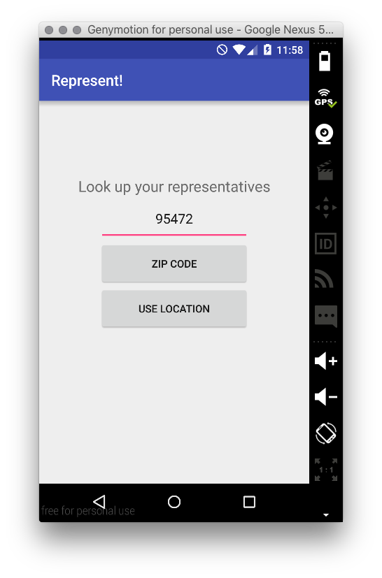
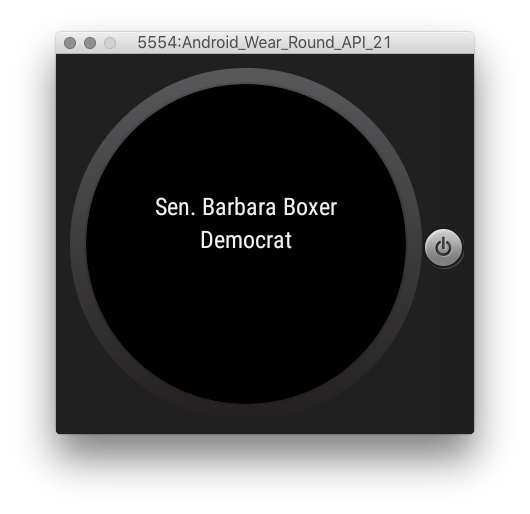

# PROG 02: Represent!

Aaron Zhou

This is an app that allows people to find their representatives and senators. It takes either a zip code or location and displays a list of reps and senators. 
The watch will also display the names as well as the district results for the 2012 election. 

## Demo Video

[2b Demo](https://youtu.be/ZwotbrLl7kc)

[2c Demo](https://www.youtube.com/watch?v=MN0VaJudbcs)

## Screenshots

